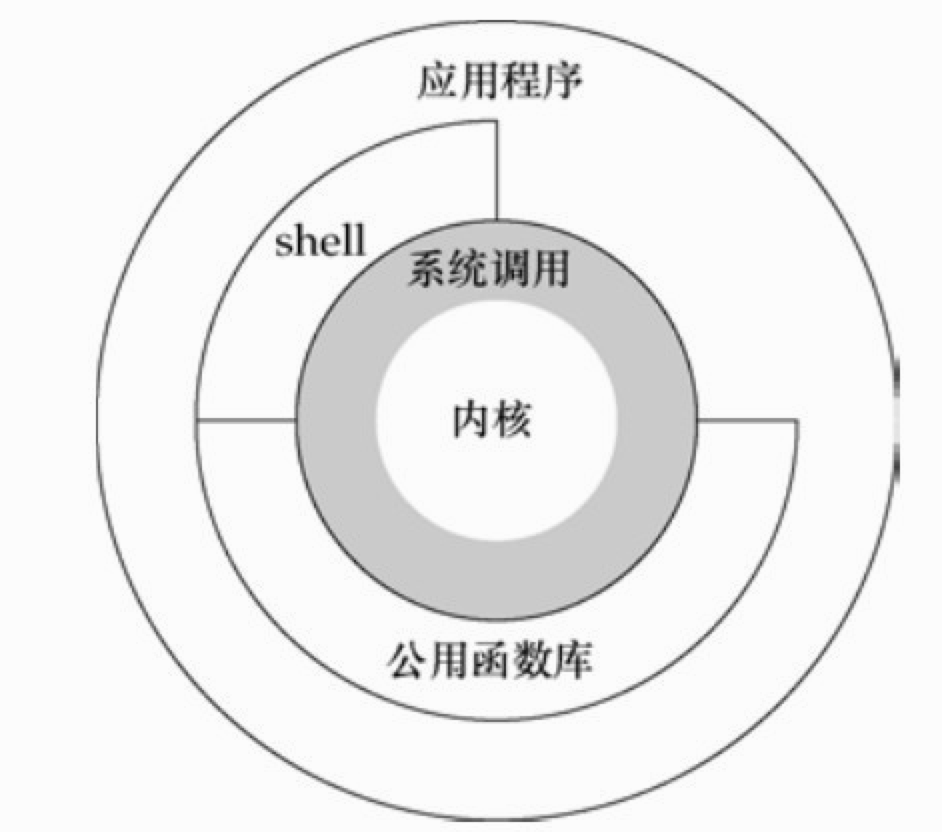
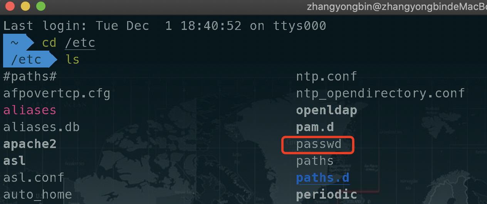

# 一.UNIX基础知识

## 1.引言

操作系统环境是用的CentOS7，但是应该所有linux系统操作都是相同的，并且因为都是UNIX内核。希望能坚持下去，也能把笔记记好吧。

 

## 2.UNIX体系结构

  
   
   
    

图1：UNIX操作系统的体系结构

如图所示，操作系统所对应的是内核( kernel )部分，内核的接口被称为系统调用。公用函数库构建在系统调用接口之上，对系统调用进行封装，应用程序既可使用公共函数库，也可使用系统调用。shell 是一个特殊的应用程序，为运行其他应用程序提供了一个接口。

> 操作系统=内核，需要用系统调用才能使用操作系统为我们工作，例如进行内存的分配，设备的IO等。shell和公共函数都能直接进行系统调用，应用程序可以直接进行系统调用，也可以使用shell和公共函数库里的函数，从而间接进行系统调用。[1]

 

## 3.登录

### 3.1登录名

用户在登录UNIX系统键入用户名和密码时，系统在其口令文件中查看登录名： 口令文件通常在/etc/passwd中

  
   
   
    

图2：passwd口令文件

### 3.2 shell

用户登录后，系统通常先显示一些系统信息，然后用户就可以向 shell 程序键入命令。

shell 是一个命令行解释器，它读取用户输入，然后执行命令。shell 的用户输入通常来自于终端(交互式shell)，有时则来自于文件(称为shell脚本)。

 

## 4 文件和目录

### 4.1 文件系统

UNIX文件系统是目录和文件的一种层次结构，所有东西的起点是称为根(root)的目录，这个目录的名称是一个字符“/”。

目录(directory)是一个包含目录项的文件。在逻辑上，可以认为每个目录项都包含一个文件名，同时还包含说明该文件属性的信息。

# 二.UNIX标准与实现

[1].[UNIX环境高级编程（APUE）第1章（CentOS8环境）-UNIX基础知识](https://zhuanlan.zhihu.com/p/130801658)

