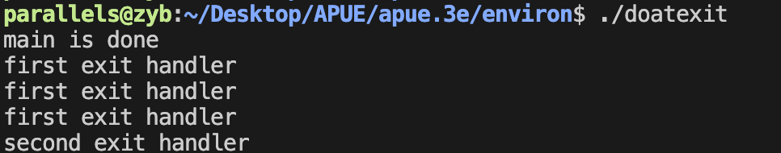
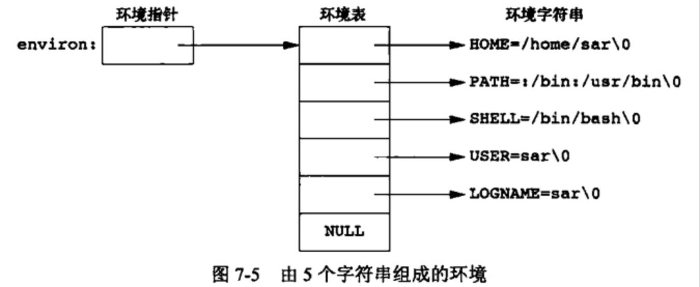
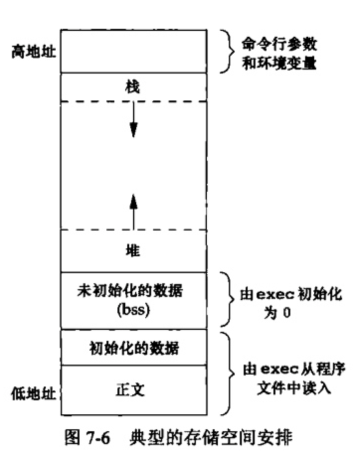

> 本章主要的学习内容：
>
> + main函数是如何被调用的
>
> + 命令行参数是如何传递给新程序的
>
> + 典型的存储空间布局是什么样式
>
> + 如何分配另外的存储空间
>
> + 进程如何使用环境变量
>
> + 进程的不同终止方式
> + longjmp和setjmp函数以及它们与栈的交换方式

## 一.main函数

C程序总是从main函数开始执行，main函数的原型是：

```c
int main(int argc, char *argv);
```

>  其中，argc是命令行参数的数目，argv是指向参数的各个指针所构成的数组

**当内核执行C程序时(使用一个exec函数),在调用main前先调用一个特殊的启动例程**。  

**可执行程序文件将此启动例程指定为程序的起始地址—这是由连接编辑器设置的,而连接编辑器则由C编译器调用。** 启动例程从内核取得命令行参数和环境变量值,然后为按上述方式调用main函数做好安排。

## 二.进程终止

有8种方法使得进程终止(termination)，其中5种为正常终止：

1. 从main返回
2. 调用exit
3. 调用 _exit 或  _Exit
4. 最后一个线程从其启动例程返回
5. 从最后一个线程调用 pthread_exit

异常终止有3种方式,它们是:

1. 调用 abort
2. 接到一个信号
3. 最后一个线程对取消请求做出响应

### 1.退出函数

3个函数用于正常终止一个程序: _ exit和 _Exit立即进入内核, exit则先执行一些清理处理,然后返回内核。

```c
#include <stdlib.h> 
void exit(int status); 
void _Exit(int status);
 
#include <unistd.h> 
void _exit(int status);
```

> `exit`函数总是执行一个标准I/O库的清理关闭操作:对于所有打开流调用fclose函数。这造成输出缓冲中的所有数据都被冲洗(写到文件上)
>
> 3个退出函数都带一个整型参数,称为终止状态(或退出状态, exit status)。大多数UNIX系统 shell都提供检查进程终止状态的方法。

### 2.atexit函数

按照ISO C的规定,一个进程可以登记多至32个函数,这些函数将由exit自动调用。我们称这些函数为终止处理程序( exit handler),并调用 atexit函数来登记这些函数。

```c
#include <stdlib.h>
int atexit(void (*func)(void));
// Returns: 0 if OK, nonzero on error
```

>  其中, `atexit`的参数是一个函数地址,当调用此函数时无需向它传递任何参数,也不期望它返回一个值。exit调用这些函数的顺序与它们登记时候的顺序相反。同一函数如若登记多次也会被调用多次。

exit首先调用各终止程序，然后关闭（通过fclose）所有打开的流

<div align = center></div>

注意,**内核使程序执行的唯一方法是调用一个exec函数。进程自愿终止的唯一方法是显式或隐式地(通过调用exit)调用exit或Exit**。进程也可非自愿地由一个信号使其终止。

> atexit函数有点像析构函数的意思

```c
#include "apue.h"

static void	my_exit1(void);
static void	my_exit2(void);

int
main(void)
{
	if (atexit(my_exit2) != 0)
		err_sys("can't register my_exit2");

	if (atexit(my_exit1) != 0)
		err_sys("can't register my_exit1");
	if (atexit(my_exit1) != 0)
		err_sys("can't register my_exit1");
	if (atexit(my_exit1) != 0)
		err_sys("can't register my_exit1");

	printf("main is done\n");
	return(0);
}

static void
my_exit1(void)
{
	printf("first exit handler\n");
}

static void
my_exit2(void)
{
	printf("second exit handler\n");
}
```

<div align = center></div>

### 3.命令行参数

当执行一个程序时,调用exec的进程可将命令行参数传递给该新程序。

ISO C和POSIX.1都要求argv[argc]是一个空指针。这就使我们可以将参数处理循环改写为

```c
for(i = 0; argv[i] != NULL; i++)
```

### 4.环境表

每个程序都接收到一张环境表。与参数表一样,**环境表也是一个字符指针数组**,其中每个指针包含一个以null结束的C字符串的地址。全局变量 environ则包含了该指针数组的地址

<div align = center></div>

### 5.C程序的存储空间布局

C程序一直由以下几个部分组成：

<div align = center></div>

+  **正文段。** 这是由CPU执行的机器指令部分。通常正文段是可共享的，但通常也只能制度，防止程序由于意外而修改其指令。
+  **初始化数据段。** 通常将此段称为数据段,它包含了程序中需明确地赋初值的变量。
+  **未初始化数据段。** 通常将此段称为bss段 (名称来源于早期汇编程序一个操作符,意思是“由符号开始的块”( block started by symbol))。在程序开始执行之前， **内核将此段中的数据初始化为0或空指针** 。
+  **栈。** 自动变量以及每次函数调用时所需保存的信息都存放在此段中。
+  **堆。** 通常在堆中进行动态存储分配。

> +  a.out 中还有其他类型的段，如符号表的段，包含调试信息的段以及包含动态共享库链接表的段等。这些部分并不装载到进程执行的程序映像中。
>
> + 未初始化数据段的内容并不存放在磁盘程序文件中。其原因是,内核在程序开始运行前将它们都设置为0。需要存放在磁盘程序文件中的段只有正文段和初始化数据段

### 6.共享库

+ 共享库使得**可执行文件中不再需要包含公用的库函数** ，而只需在所有进程都可引用的存储区中保存这种库例程的一个副本。
+ 程序第一次执行或者第一次调用某个库函数时,**用动态链接方法将程序与共享库函数相链接**。这减少了每个可执行文件的长度,但增加了一些运行时间开销。这种时间开销发生在该程序第一次被执行时,或者每个共享库函数第一次被调用时。
+ 共享库的另一个优点是**可以用库函数的新版本代替老版本而无需对使用该库的程序重新连接编辑**(假定参数的数目和类型都没有发生改变)

### 7.存储空间分配

ISO C说明了3个用于存储空间动态分配的函数

1. malloc,分配 **指定字节数的存储区** 。此存储区中的初始值不确定。
2. calloc,为 **指定数量 指定长度** 的对象分配存储空间。**该空间中的每一位(bit)都初始化为0**
3. realloc, **增加或减少以前分配区的长度** 。当增加长度时,可能需将以前分配区的内容移到另一个足够大的区域,以便在尾端提供增加的存储区,而新增区域内的初始值则不确定。

```c
#include <stdlib.h>

// All three return: non-null pointer if OK, NULL on error
void *malloc(size_t size);
void *calloc(size_t nobj, size_t size);
void *realloc(void *ptr, size_t newsize);
//这3个分配函数所返回的指针一定是适当对齐的,使其可用于任何数据对象。

void free(void *ptr);
//free函数释放ptr所指向的存储空间。被释放的空间通常被送入可用存储区池。以后可在调用上述3个分配函数时再分配。
```

### 8.环境变量

环境字符串的形式是 `name=value`

UNIX内核并不查看这些字符串,它们的解释完全取决于各个应用程序。

可以使用getenv函数获得环境变量的值：

```c
#include <stdlib.h> 

//此函数返回一个指针,它指向`name=value`字符串中的 value。
char *getenv(const char *name); 
// Returns: pointer to value associated with name, NULL if not found
```

设置环境变量的三个函数:

```c
#include <stdlib.h> 

//putenv取形式为name=value的字符串,将其放到环境表中。如果name已经存在,则先删除其原来的定义。
int putenv(char *str);
// Returns: 0 if OK, nonzero on error

//setenv将name设置为value。
int setenv(const char *name, const char *value, int rewrite); 
//unsetenv删除name的定义
int unsetenv(const char *name); 
// Both return: 0 if OK, −1 on error
```

> setenv必须分配存储空间，以便依据其参数创建name = value字符串。
>
> putenv可用自由地传递给它的参数字符串放到环境中。

这些函数在修改环境表时是如何进行操作的呢？ 

+ 环境表(指向实际`name=value`字符串的指针数组) 和 环境字符串 **通常存放在进程存储空间的顶部(栈之上)。**
+ 删除一个字符串很简单——只要先在环境表中找到该指针,然后将所有后续指针都向环境表首部顺次移动一个位置。
+ 但是增加一个字符串或修改一个现有的字符串就困难得多。
  + 环境表和环境字符串通常占用的是进程地址空间的顶部，所以它不能再向高地址方向(向上)扩展：同时也不能移动在它之下的各栈帧，所以它也不能向低地址方向(向下)扩展。两者组合使得该空间的长度不能再增加。


### 9.函数setjmp和longjmp

在C中,goto语句是不能跨越函数的,而执行这种类型跳转功能的是函数 setjmp和1ongjmp两个函数对于处理发生在很深层嵌套函数调用中的出错情况是非常有用的

setjmp和1ongjmp函数可以看成一个非局部goto函数。非局部指的是这不是由普通的C语言goto语句在一个函数内实施的跳转,而是在栈上跳过若于调用帧,返回到当前函数调用路径上的某一个函数中。

```c
#include <setjmp.h> 

int setjmp(jmp_buf env); 
// Returns: 0 if called directly, nonzero if returning from a call to longjmp
void longjmp(jmp_buf env, int val);
```


### 10.函数getrlimit和setrlimit

每个进程都有一组资源限制,其中一些可以用getrlimit和 setrlimit函数查询和更改。

```c
#include <sys/resource.h>

int getrlimit(int resource, struct rlimit *rlptr);
int setrlimit(int resource, const struct rlimit *rlptr);
// Both return: 0 if OK, −1 on error
```

对于这两个函数的每一次调用都指定一个资源以及一个指向下列结构的指针。

```c
struct rlimit 
{
  	rlim_t rlim_cur;//软限制
  	rlim_t rlim_max;//硬限制
}
```

在更改资源限制时，必须遵循下面三条原则：

+ 任何一个进程都可将一个软限制值更改为小于或等于其硬限制值。
+ 任何一个进程都可降低其硬限制值，但它必须大于或等于其软限制值。这种降低对于普通用户是不可逆的。
+ 只有超级用户进程可以提高硬限制值。
